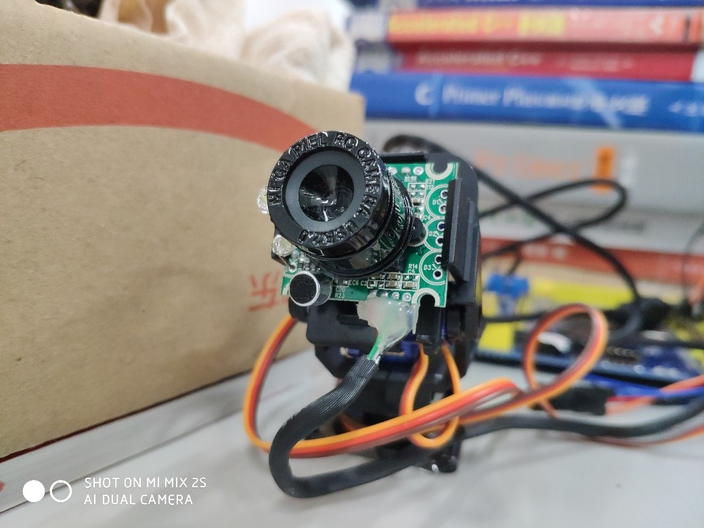
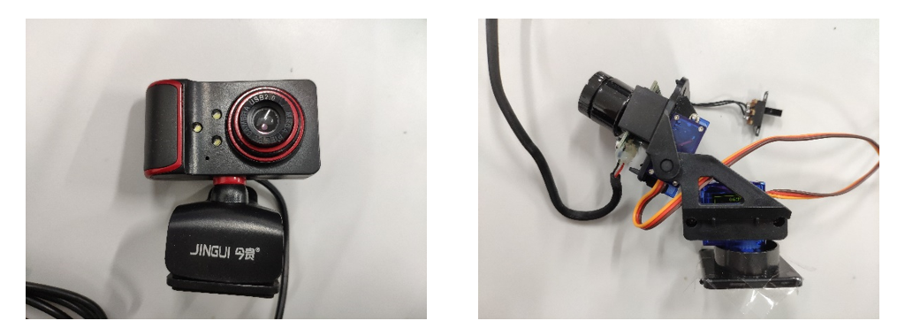
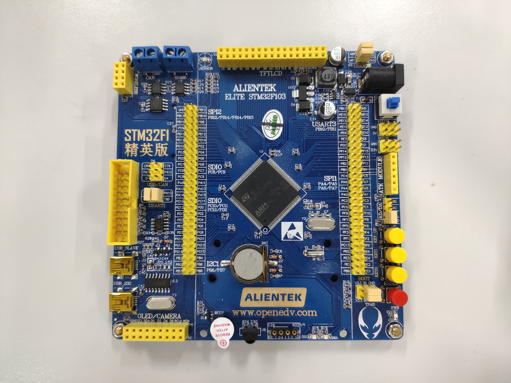
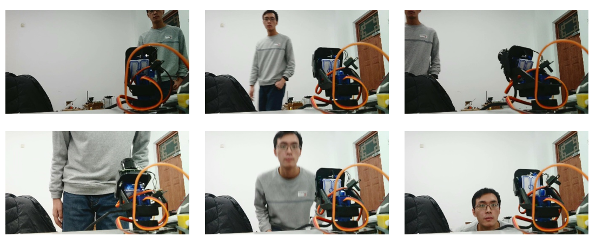
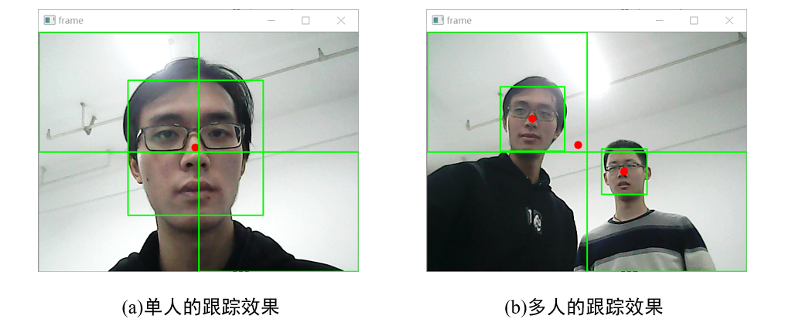

# Face Tracking Pan-Tilt Camera

    

# 目录
- [一. 概述](#一-概述)
- [二. 实现方法及步骤](#二-实现方法及步骤)
    - [2.1 硬件部分](#21-硬件部分)
    - [2.2 软件部分](#22-软件部分)
        - [2.2.1 python环境及主要使用的库](#221-python环境及主要使用的库)
        - [2.2.2 PC端：图像处理与人脸检测](#222-pc端图像处理与人脸检测)
        - [2.2.3 单片机：实现PD控制器](#223-单片机实现pd控制器)
- [三. 实现效果](#三-实现效果)

## 一. 概述

本项目为基于OpenCV-Python和STM32F103单片机的二自由度人脸跟踪舵机云台系统。

    

本系统的预期功能是实时检测摄像头中出现的人脸，并对其进行跟踪。要实现该功能，主要应解决如下问题：

1. **图像采集**
2. **人脸检测**
3. **舵机控制**

具体实现思路如下：

**图像采集**方面，使用普通的usb摄像头，这样可以直接得到数字图像无需进行数模转换，而且价格低廉，在不要求高精度的情况下比较适合。将usb摄像头直接通过usb数据线接到电脑，即可在PC端得到实时图像。

**人脸检测**方面，在PC端编写用于人脸检测的python程序。使用opencv库，首先对从摄像头得到的每一帧实时图像进行预处理，然后调用opencv自带的harr分类器检测人脸的位置。将检测到的人脸的中心点坐标用串口发送给STM32单片机即可。

**舵机控制**方面，使用STM32单片机，根据串口接收到的来自上位机的坐标分别对两个舵机进行独立的位置控制。具体思路是，将图像的中心点的横纵坐标（恒定值）与人脸中心点的横纵坐标分别作差，将该差值作为偏差输入到STM32中实现的两个PD控制器中，计算所需占空比，产生两路PWM波驱动舵机向偏差减小的方向转动。

## 二. 实现方法及步骤

### 2.1 硬件部分

首先搭建二自由度云台的机械结构。为尽可能节约成本，抛弃了最初搭建金属结构、使用大力矩舵机的方案，而是在淘宝上购置成本低廉的塑料FPV双轴舵机云台和SG90小舵机进行安装，得到一个低成本的二自由度云台架。

对普通usb摄像头进行拆解，安装到云台架上，即完成了基本的机械结构。

    

选用正点原子的STM32F1精英板作为单片机开发板，芯片型号为STM32F103ZET6。

    

### 2.2 软件部分

#### 2.2.1 python环境及主要使用的库

* python 3.6 (Anaconda)  
- numpy 1.14.0  
* opencv-python 3.4.0  
- pyserial 3.4  

#### 2.2.2 PC端：图像处理与人脸检测

使用opencv-python对usb摄像头的实时图片进行人脸检测。为提高检测速度，首先对图片做预处理，将彩色图像转化为灰度图像。然后使用opencv自带的harr级联分类器检测人脸位置，并将人脸中心点坐标通过串口发送给STM32单片机。

为了解决多个人脸同时出现在画面中造成系统不稳定的现象，对算法进行改进，对每帧图像计算所有人脸中心点的形心，这样当多个人脸同时出现时，摄像头将对准所有人脸的平均的几何中心。

该部分的源代码详见：

* [track_face.py](/code/track_face.py)

#### 2.2.3 单片机：实现PD控制器

STM32单片机主要应完成：接收串口数据、实现PD控制器、输出PWM驱动舵机三个任务。下面列出部分关键代码，分别介绍实现方法。

**1. 串口数据接收**

STM32单片机要通过串口，根据设置的通讯协议接收PC端传来的坐标(X,Y)，将横纵坐标两个值分别存储到全局变量coords中。为此，编写串口接收程序如下：

* [serial.c](/code/control/HARDWARE/serial/serial.c)

上述程序中，为了更清晰地观察到单片机接收串口数据的情况，使用了开发板上的LED灯，在数据传输时闪烁。LED灯部分的驱动程序如下：

* [led.c](/code/control/HARDWARE/LED/led.c)

**2. PD控制器**

将实际坐标数据与目标坐标作差，将差值作为偏差传递给PID控制器，从而得到需要的PWM占空比。

PID参数通过实验确定。实验表明，仅采用PD的效果更佳。

这一部分的源码pid.c如下：

* [pid.c](/code/control/HARDWARE/PID/pid.c)

**3. 输出PWM**

根据PD控制器输出的值作为占空比，通过时钟输出PWM信号。源码如下：

* [timer.c](/code/control/HARDWARE/TIMER/timer.c)

**4. 主函数**

* [main.c](/code/control/USER/main.c)

## 三. 实现效果

经测试，该系统能够实现预期的功能。经过调参后，调节时间很短，超调较小，系统的快速性和平稳性均能达到预期目标。系统的不足之处在于有一定稳态误差，但是考虑到舵机成本较低，系统的精度处在可以接受的范围内。

    

下图分别是单人和多人的跟踪效果：

    

